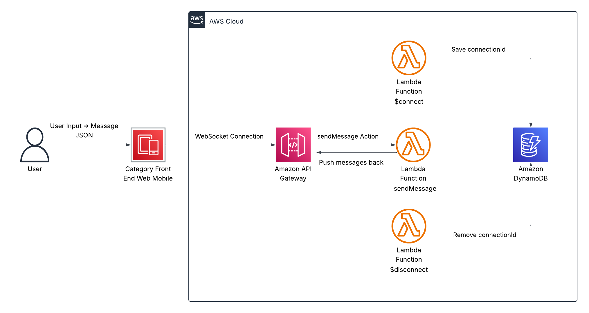
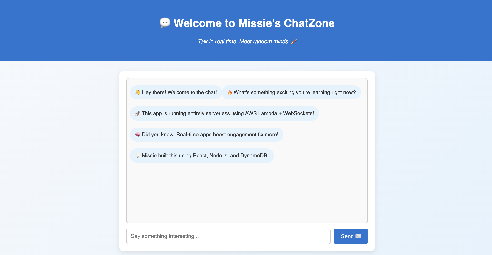

# 💬 Real-Time Chat App (Serverless on AWS)

A fully functional, real-time chat application built using **AWS Lambda, API Gateway (WebSocket), DynamoDB, and S3**, with a clean mobile-responsive frontend.

> This project is designed to demonstrate advanced **serverless architecture**, WebSocket communication, and real-time data delivery — all without managing any servers.

---

## 🚀 Live Demo

To test the live version:

1. Open the [frontend/index.html](./frontend/index.html) in your browser.
2. Messages are instantly sent and received using a persistent WebSocket connection.
3. The backend is fully powered by AWS services.

---

## 🧠 Features

- 🔁 **Real-Time Messaging** using WebSocket API
- ⚙️ **Serverless Backend** (AWS Lambda, API Gateway)
- 💽 **DynamoDB** stores active WebSocket connection IDs
- ☁️ **S3-hosted frontend**
- 🧾 **Infrastructure fully documented**
- 📱 **Mobile-responsive UI**
- 🔐 **IAM policies** with least-privilege access

---

## 🛠️ Tech Stack

| Layer    | Tech Used                                    |
| -------- | -------------------------------------------- |
| Frontend | HTML, CSS, JavaScript                        |
| Backend  | AWS Lambda (Node.js), API Gateway WebSocket  |
| Database | Amazon DynamoDB                              |
| Hosting  | S3 (Frontend), API Gateway (WebSocket API)   |
| IAM      | Custom policies to allow `ManageConnections` |

---

## 🗺️ Architecture

---

## 🔌 WebSocket Routes

| Route Key     | Purpose                 | Lambda             |
| ------------- | ----------------------- | ------------------ |
| `$connect`    | On client connection    | `chat-connect`     |
| `$disconnect` | On client disconnect    | `chat-disconnect`  |
| `sendMessage` | Handle message delivery | `chat-sendMessage` |

See [api-gateway-routes.md](./api-gateway-routes.md) for full breakdown.

---

## 🧾 DynamoDB Table

**Table Name:** `ChatConnections`  
**Primary Key:** `connectionId (String)`

Used to keep track of active users for potential broadcasting and management.

Details in [dynamodb-schema.md](./dynamodb-schema.md)

---

## 🔐 IAM & Permissions

- **IAM Role** for `chat-sendMessage` has inline policy:
  - Action: `execute-api:ManageConnections`
  - Resource: `*`
- See [iam-policies.md](./iam-policies.md) for policy JSON.

---

## 💡 How It Works

1. **Client connects** via WebSocket to API Gateway
2. `$connect` route triggers `chat-connect` Lambda
   - Stores connectionId in DynamoDB
3. User sends a message using `sendMessage` route
4. `chat-sendMessage` Lambda uses `PostToConnection` to reply
5. `$disconnect` route cleans up the connection

---

## 📱 UI Preview

 <!-- Optional image -->

- Styled for mobile and desktop
- Fun auto-messages for first-time visitors
- Clean bubbles for chat UX

---

## ✨ Author

Built with ❤️ by **Missie Kahsay**  
Certified AWS Solutions Architect + JavaScript Developer  
[LinkedIn →](https://www.linkedin.com/in/missiekahsay/)

---

## 📦 License

MIT – feel free to use, modify, and share!
